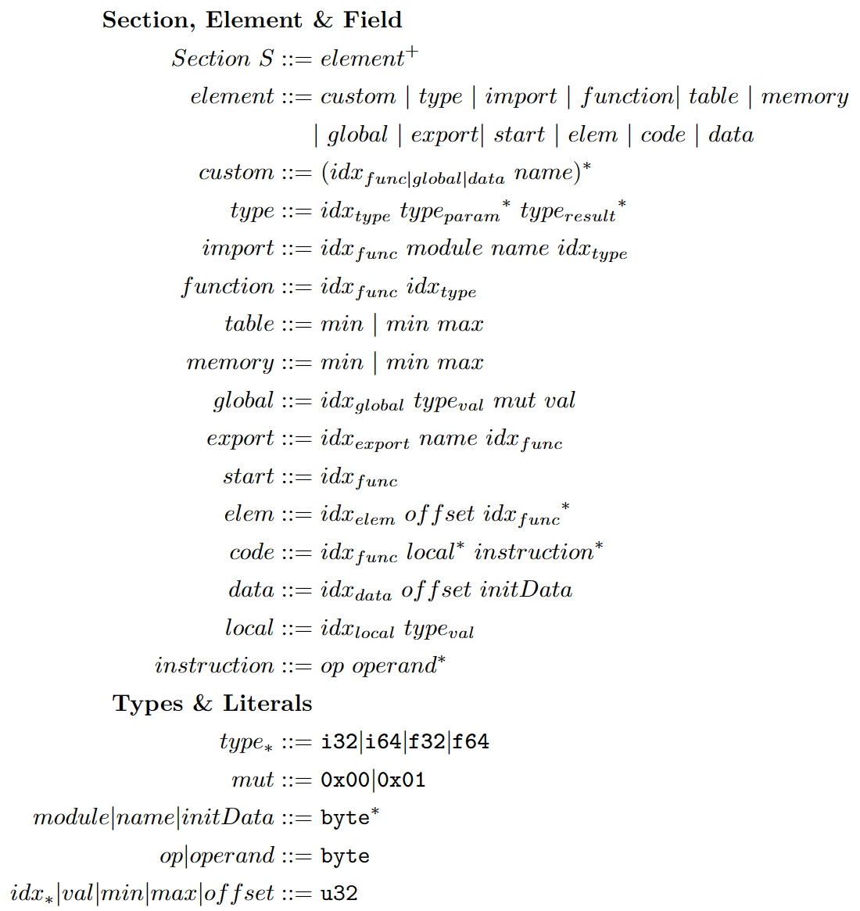

# BREWasm

BREWasm: A general purpose static binary rewriting framework for Wasm, which aims at reducing the complexity of the Wasm
binary format.

## Features

BREWasm consists of four key components: the Wasm Parser, section rewriter, semantics rewriter, and Wasm Encoder. The
Wasm parser and encoder are built using our abstraction of the Wasm binary, which is represented as a formal format
comprising a list of objects. The parser and encoder effectively convert the Wasm binary and an array of objects into
each other, with each object containing multiple attributes.

<div align=center>

  <div style="margin-top: 10px; margin-bottom: 10px">
    <b>Formal definition of sections, elements and fields in Wasm.</b>
  </div>
</div>  

- The section rewriter directly interacts with the formal definition, e.g., inserting/deleting a new object or modifying
  attributes of existing objects. It packs these fine-grained rewriting functions into APIs.
- The semantics rewriter further combines the fine-grained APIs of section rewriter and offers another set of high-level
  APIs, where each of them possesses rich semantics as following, like inserting a function, and append a piece of
  linear memory.
    - Global Variables
    - Import & Export
    - Linear Memory
    - Function
    - Custom Content

## Installation

### Python package

BREWasm is currently available on PIP repositories.

Install BREWasm::

```
pip install BREWasm
```


## Examples

### Section Rewriter

The basic operation of the section rewriter is `select`, `insert`, `update` and `delete`.

```python
from BREWasm import *

binary = BREWasm('a.wasm')  # Open a Wasm binary file

# Initialize a section rewriter of the global section. 
global_rewriter = SectionRewriter(binary.module, globalsec=binary.module.global_sec)

# Select all the items in global section
global_list = global_rewriter.select(Global())
# Get the attribute globalidx of a global item, whose index is one.
idx = global_list[1].globalidx
# Insert a new global item at the index idx of the global section
global_rewriter.insert(Global(idx), Global(valtype=ValTypeI32, val=100))
# Delete the global item whose index is idx.
global_rewriter.delete(Global(idx))
# Emit a new binary file
binary.emit_binary('b.wasm')
```

### Semantics Rewriter

```python
from BREWasm import *

binary = BREWasm('a.wasm') # Open a Wasm binary file

# Initialize a semantics rewriter of the function semantics
function_rewriter = SemanticsRewriter.Function(binary.module)
# Define the instructions of function
func_body = [Instruction(LocalGet, 0), Instruction(LocalGet, 1), Instruction(I32Add, 0), Instruction(Nop)]
# Insert a internal function in the binary
function_rewriter.insert_internal_function(idx=1, params_type=[ValTypeI32, ValTypeI32], results_type=[ValTypeI32], local_vec=[Local(0, ValTypeI32), Local(1, ValTypeI64)], func_body=func_body)
# Emit a new binary file
binary.emit_binary('b.wasm')
```

## Documentation

The complete documentation can be found [here](https://brewasm-project.readthedocs.io/en/latest/).

## Publications

Our work is accepted by SAS 2023. If you have used BREWasm in academic work, please cite our work by:
```
@inproceedings{cao2023brewasm,
  title={Brewasm: a general static binary rewriting framework for webassembly},
  author={Cao, Shangtong and He, Ningyu and Guo, Yao and Wang, Haoyu},
  booktitle={International Static Analysis Symposium},
  pages={139--163},
  year={2023},
  organization={Springer}
}
```
